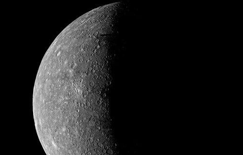

# fits
###
programs in c,c++ and fortran to read and write FITS files
###
Works on MS Windows with the MinGW gcc,g++,gfortran compilers.
To compile on GNU/linux with gcc,g++,gfortran
(needs NASA cfitsio lib.). It is supposed that
the the libraries and .h header files are in the directory
pointed by CFITSIO_HOME env variable, otherwise change the makefile.
It can be compiled also with clang,clang++ and flang.
###
`make`
###
to run on linux
###
`./writefimage 3 5 img3x5_001.fits`
###
`./readfimage img3x5_001.fits`
###
fimage2ascii converts a fits image file in image matrix data ascii file.
###
`./fimage2ascii <<< m31sl2.fits 2>err.log > m31sl2.asc`
###
`addfbtable.c`
###
`addfbtable.exe`
###
`usage:addfbtable.exe <infile.fits>`
###
now running this command, where mynewfile001.fits it's a fits
image of Mercury planet surface, seen by Mariner 10 spacecraft in 1974.
###

###
`addfbtable.exe mynewfile001.fits` 
###
cfirst.c
###
changekeys.c
###
cookbook.c
###
createimage.c
###
createraw.c
###
fimage.c
###
fimage2bin.c
###
pofp2d.c
###
pofp2df.c
###
readfdimg.c
###
readfimage.c
###
readfimg.c
###
readraw.c
###
readrawf.c
###
readwriterawf.c
###
rff.c
###
sizes.c
###
structrows.c
###
testf1.c
###
testf2.c
###
testf3.c
###
teststrx.c
###
writefimage.c
###
writefits.c
###
writeftable.c
###
